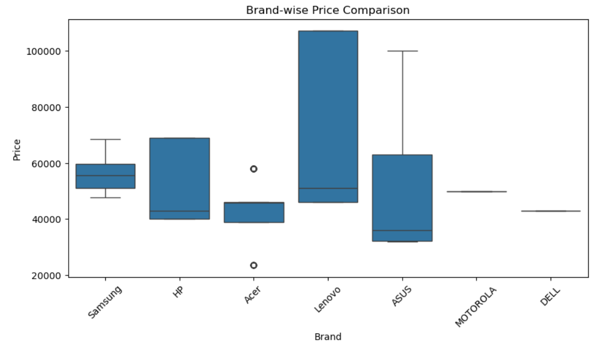
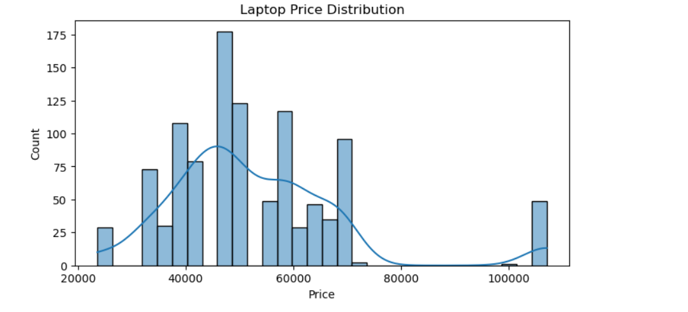
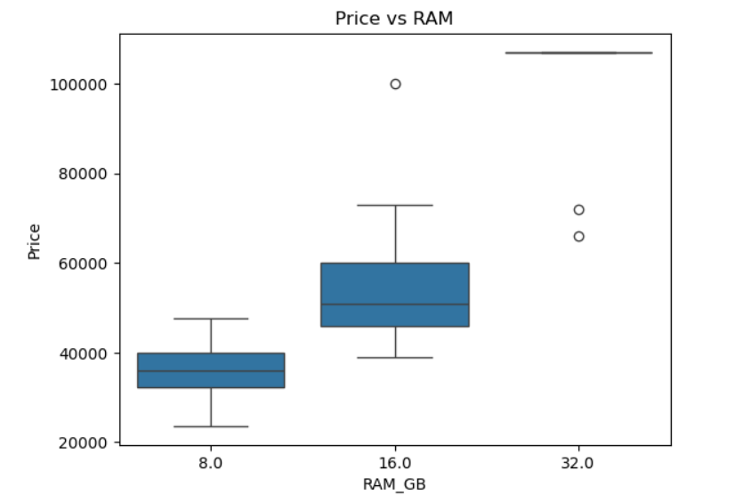
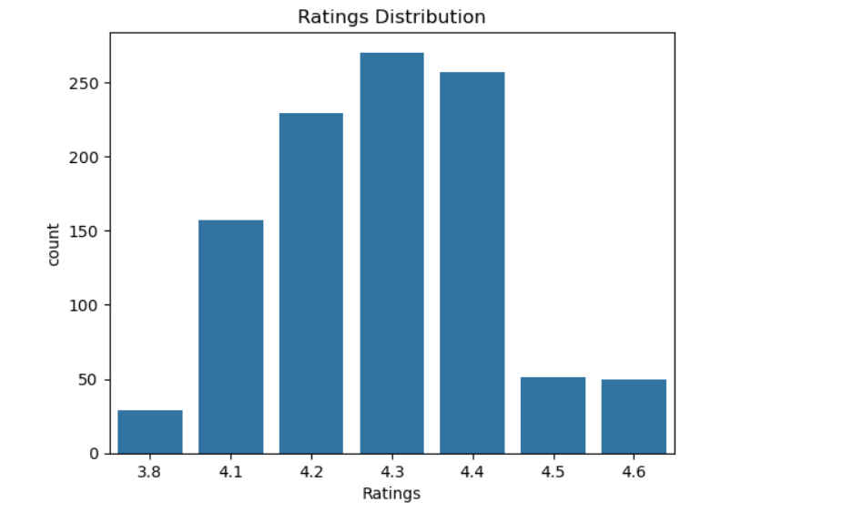

# Flipkart Laptops Price & Rating Analysis | Web Scraping + EDA 💻📊

## 📌 Project Overview
This project analyzes laptop prices and customer ratings using real-world data scraped from Flipkart.

The objective is to understand how different laptop features such as Brand, RAM, Storage, Processor, Operating System, Display Size, and Warranty influence pricing and ratings.

This project demonstrates skills in web scraping, data cleaning, and exploratory data analysis (EDA).

---

## 🎯 Objectives
- Scrape laptop data from Flipkart
- Extract key features affecting price
- Perform data cleaning and preprocessing
- Analyze pricing trends
- Study the relationship between features and ratings

---

## 🛠 Tech Stack
- Python
- Requests
- BeautifulSoup
- Pandas
- NumPy
- Matplotlib
- Seaborn
- Jupyter Notebook

---

## 🔎 Data Collection (Web Scraping)

- Scraped multiple pages of laptop listings from Flipkart
- Extracted:
  - Brand
  - Model
  - Price
  - Ratings
  - Processor
  - RAM
  - Storage
  - Display
  - Operating System
  - Warranty
- Used `requests` and `BeautifulSoup` for HTML parsing
- Stored extracted data into a structured Pandas DataFrame

---

## 🧹 Data Cleaning & Preprocessing

- Replaced missing values with NaN
- Converted Price column to integer
- Converted Ratings column to float
- Checked dataset shape and structure
- Handled inconsistent or unavailable values

---

## 📊 Exploratory Data Analysis (EDA)

- Brand-wise price comparison
- Rating distribution analysis
- Feature impact on pricing
- Price variation based on RAM and Storage
- Summary statistics of numerical columns
- Visualizations using Matplotlib and Seaborn

---

## 📈 Key Insights

- Identified price differences across laptop brands
- Observed how RAM and Storage significantly influence price
- Analyzed rating distribution patterns
- Found trends between premium features and higher ratings

---

## 🚀 How to Run the Project

1. Clone the repository
2. Install required libraries:pip install requests beautifulsoup4 pandas numpy matplotlib seaborn
3. 3. Open the `.ipynb` file in Jupyter Notebook
4. Run all cells

---

## 📂 Project Structure

- Web Scraping
- DataFrame Creation
- Data Cleaning
- Data Type Conversion
- Exploratory Data Analysis
- Visualization

---

## 📊 Sample Visualizations

### 1️⃣ Brand-wise Price Comparison

---

### 2️⃣ Laptop Price Distribution

---

### 3️⃣ Price vs RAM Analysis

---

### 4️⃣ Ratings Distribution

---

### 5️⃣ Correlation Heatmap

## 💡 Future Enhancements

- Build price prediction model using Machine Learning
- Create interactive dashboard (Streamlit / Power BI)
- Perform sentiment analysis on reviews
- Automate scraping with scheduling

---

## 👤 Author
Vamsi Kumar Reddy
Aspiring Data Analyst | SQL | Python | Data Visualization  
